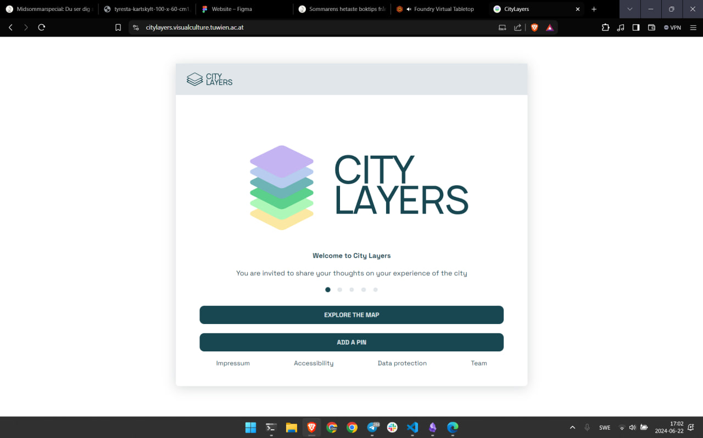
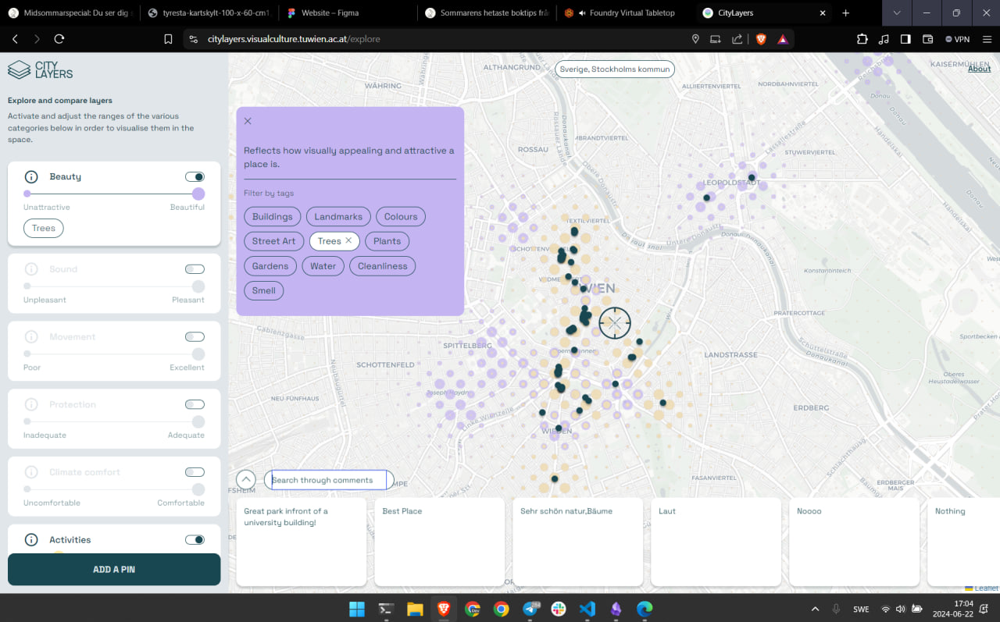
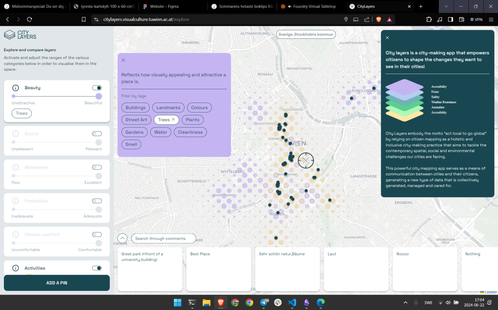
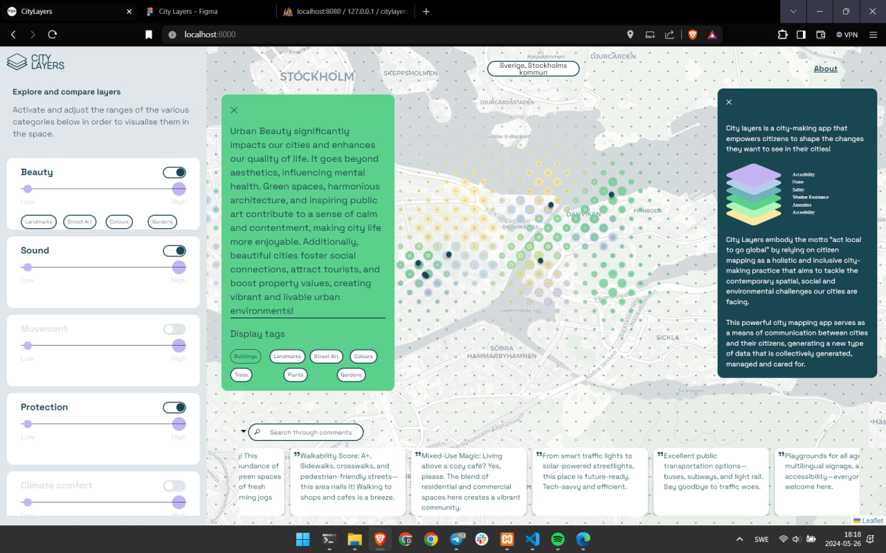
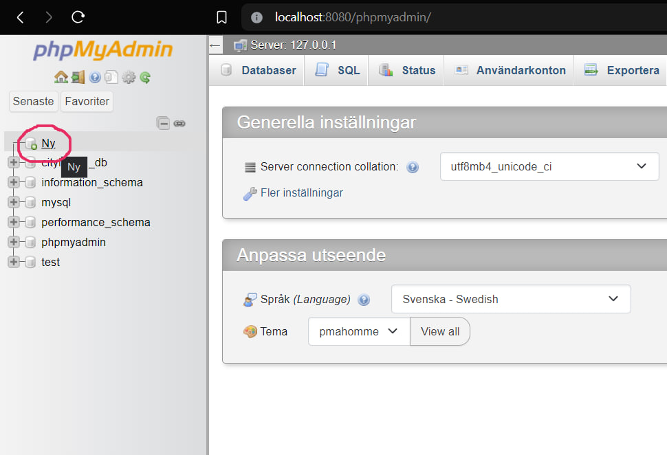
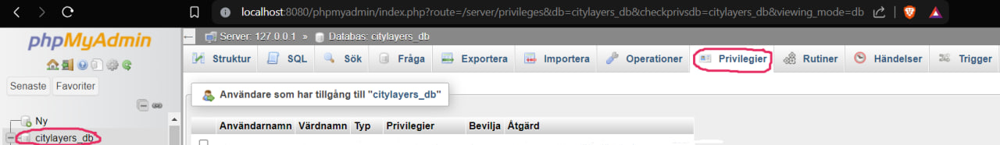
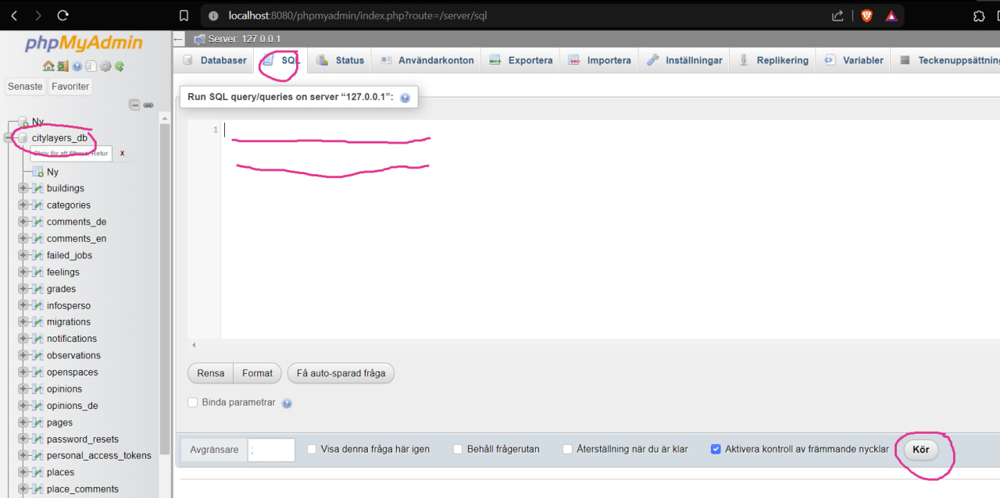

<!-- Improved compatibility of back to top link: See: https://github.com/WebApp24/WebApp24/pull/73 -->
<a name="readme-top"></a>

[![Contributors][contributors-shield]][contributors-url]
[![Forks][forks-shield]][forks-url]
[![Stargazers][stars-shield]][stars-url]
[![Issues][issues-shield]][issues-url]
[![MIT License][license-shield]][license-url]
[![LinkedIn][linkedin-shield]][linkedin-url]


<!-- PROJECT LOGO -->
<br />
<div align="center">
  <a href="https://github.com/WebApp24/WebApp24">
    
    
  </a>

  <h3 align="center"  > City Layers </h3>

  <p align="center">
    City Layers: Citizen Mapping as a Practice of City-Making 
    <br/>
    <div>
    <a href="https://www.tuwien.at/">
    <svg role="img" aria-label="TU Wien - homepage" version="1.1"     id="tuw-logo" xmlns="http://www.w3.org/2000/svg" x="0px" y="0px" viewBox="0 0 97 97" width="30px"><path style="fill: rgb(0, 102, 153); --darkreader-inline-fill: #c4c4c4;" d="M86.5,1c5.2,0,9.5,4.3,9.5,9.5l0,76c0,5.3-4.3,9.5-9.5,9.5h-76C5.3,96,1,91.7,1,86.5l0-76C1,5.3,5.3,1,10.5,1
    H86.5z" data-darkreader-inline-fill=""></path><path style="fill: rgb(255, 255, 255); --darkreader-inline-fill: #f7f7f7;" d="M21.1,23.6h10.1v33.7H21.1V23.6z M8.3,10.5h35.5v10.1H8.3V10.5z M29.7,69.6h-3.4l-2.6,10.5l-3.1-10.5h-2.4
    l-3.1,10.5l-2.6-10.5H9.2l4.5,16.7h2.7l3.1-10.1l3.1,10.1h2.7L29.7,69.6z M86.3,86.3V69.6h-3.3v10.2l-6.6-10.2h-2.9v16.7h3.3V76
    l6.6,10.3H86.3z M63,86.3v-2.9h-7.7v-4.1h6.6v-2.9h-6.6v-3.9H63v-2.9h-11v16.7H63z M40.8,69.6h-3.3v16.7h3.3V69.6z M65.9,57.6
    l-0.5,0c-9.5-1-16.9-9-16.9-18.8V10.5h10.3l0,28c0,4.1,2.8,7.8,6.7,8.7c0.2,0,0.3,0.1,0.5,0.1L65.9,57.6z M68.9,47.3
    c0.2,0,0.3,0,0.4-0.1c3.8-1,6.7-4.6,6.7-8.7l-0.1-28h10.3v28.1c0,9.8-7.4,17.9-16.9,18.9l-0.4,0L68.9,47.3z" data-darkreader-inline-fill=""></path></svg>
    </a>
    </div>
    <a href="https://www.tuwien.at/">
      Technische Universitat Wien
    </a>
    <br/>
    <a href="https://ar.tuwien.ac.at/en/faculty/Institutes/Institute-of-Art-and-Design/Visual-Culture">
    Department of Visual Culture, School of Architecture and Planning
    </a>
    <br />
    <br />
    <a href="https://citylayer.urbanitarian.com/">View Demo</a>
    ·
    <a href="https://github.com/WebApp24/WebApp24/issues">Report Bug</a>
    ·
    <a href="https://github.com/WebApp24/WebApp24/issues">Request Feature</a>
  </p>
</div>


<!-- TABLE OF CONTENTS -->
<details>
  <summary>Table of Contents</summary>
  <ol>
    <li>
      <a href="#about-the-project">About The Project</a>
      <ul>
      <li><a href="#intro">Intro</a></li>
        <li><a href="#built-with">Built With</a></li>
      </ul>
    </li>
    <li>
      <a href="#getting-started">Getting Started</a>
      <ul>
        <li><a href="#prerequisites">Prerequisites</a></li>
        <li><a href="#usage">Usage</a></li>
      </ul>
    </li>
    <li><a href="#license">License</a></li>
    <li><a href="#contact">Contact</a></li>
    <li><a href="#acknowledgments">Acknowledgments</a></li>
  </ol>
</details>


<!-- ABOUT THE PROJECT -->
## About The Project


Citizens are invited to contribute to a collective network of data on citizens’ spatial needs by
sharing their thoughts on a range of urban phenomena.
                    

### Intro

CityLayers at its current stage:

<video width="960" height="640" controls>
  <source src="assets/20240526_1808.mp4" type="video/mp4">
Your browser does not support the video tag.
</video>


<div>
  
  
  
  
</div>


<p align="right">(<a href="#readme-top">back to top</a>)</p>


### Built With


* [PHP](https://www.php.net/)
* [JS](https://www.javascript.com/)
* [SCSS](https://sass-lang.com/)
* [MySQL](https://www.mysql.com/)

<p align="right">(<a href="#readme-top">back to top</a>)</p>


<!-- GETTING STARTED -->
## Getting Started for developers

Refer to [API quickstart](./quickstart_api.md) when developing the frontend part 🙃

### Prerequisites

* [PHP](https://www.php.net/)
* [XAMPP](https://www.apachefriends.org/)
* [Pear](https://pear.php.net/manual/en/installation.php)
* [Herd](https://herd.laravel.com/)

<p align="right">(<a href="#readme-top">back to top</a>)</p>
<!-- USAGE EXAMPLES -->

### Setup of the development environment

* Clone or fork the repo:
    ```sh
    git clone https://github.com/citylayers/WebApp24.git
    ```
* Install all the [prerequisites](#prerequisites)
* Go to the root folder 
    ```sh
    cd WebApp24
    ```
* Install composer dependencies:
  ```sh
  composer install
  ```
* Configure setup file:
  ```sh
  cp .env.example .env
  ```
  for Windows:
  ```sh
  copy .env.example .env
  ```
* Clear the cache 

    ```sh
    php artisan config:clear
    ```
* Generate a new encryption key

    ```sh
    php artisan key:generate
    ```

* Go to XAMPP, start Apache and MySQL Server
* Go to ```http://localhost:8080/phpmyadmin/``` (replace 8080 with your Apache server port from config file)

* Create a dataset ``citylayers_db`` if it does not exist
  

* Select your dataset; go to privileges
  

* Create a new user, add pwd, give all the necessary rights

* Set environmental variables in the config file:
  DB_CONNECTION=mysql\
  DB_HOST=127.0.0.1 \
  DB_PORT=3306 \
  DB_DATABASE=citylayers_db DB_USERNAME=your_database_username DB_PASSWORD=your_database_password

  *your_database_username* and *your_database_password* are the values you created in the previous step, when 
  adding a user account with the rights to access the database

* Run database migrations and seeders:
  ```sh
  php artisan migrate --seed
  ```

* Copy [Update query](update.sql) and run it in the SQL tab:
  

* Run the server:
  ```sh
  php artisan serve
  ```
* Install node dependencies
  ```sh
  npm install
  ```
* Run the local version
  ```sh
    npm run dev
    ```
    or
    ```sh
    npm run build
    ```
    or
    ```sh
    npx vite
    ```


<p align="right">(<a href="#readme-top">back to top</a>)</p>

<!-- LICENSE -->
## License

Distributed under the MIT License. See `LICENSE.txt` for more information.

<p align="right">(<a href="#readme-top">back to top</a>)</p>


## Contact

Lovro - [@website](https://citylayer.urbanitarian.com/) - [e-mail](mailto:lovro.koncar-gamulin@tuwien.ac.at) - [LinkedIn][linkedin-url]\
Firas Safieddine - [@website](https://www.firassafieddine.com/) - [e-mail](mailto:firas.safieddine@iaac.net) - [LinkedIn][linkedin-url]\
Stasja - [@website](https://stasyafedorova.wixsite.com/designautomation) - [e-mail](mailto:0.0stasya@gmail.com) - [LinkedIn][linkedin-url]

<p align="right">(<a href="#readme-top">back to top</a>)</p>


<!-- ACKNOWLEDGMENTS -->
## Acknowledgments

* [Department of Visual Culture, School of Architecture and Planning, Technische Universitat Wien](https://visualculture.tuwein.ac.at)
* [Austrian Science Fund(FWF)](https://www.fwf.ac.at/) - Funding of CityLayers project's first phase
* [My favorite README template](https://github.com/othneildrew/Best-README-Template)

<p align="right">(<a href="#readme-top">back to top</a>)</p>


<!-- MARKDOWN LINKS & IMAGES -->
<!-- https://www.markdownguide.org/basic-syntax/#reference-style-links -->
[contributors-shield]: https://img.shields.io/github/contributors/WebApp24/WebApp24.svg?style=for-the-badge
[contributors-url]: https://github.com/WebApp24/WebApp24/graphs/contributors
[forks-shield]: https://img.shields.io/github/forks/WebApp24/WebApp24.svg?style=for-the-badge
[forks-url]: https://github.com/WebApp24/WebApp24/network/members
[stars-shield]: https://img.shields.io/github/stars/WebApp24/WebApp24.svg?style=for-the-badge
[stars-url]: https://github.com/WebApp24/WebApp24/stargazers
[issues-shield]: https://img.shields.io/github/issues/WebApp24/WebApp24.svg?style=for-the-badge
[issues-url]: https://github.com/WebApp24/WebApp24/issues
[license-shield]: https://img.shields.io/github/license/WebApp24/WebApp24.svg?style=for-the-badge
[license-url]: https://github.com/WebApp24/WebApp24/blob/master/LICENSE.txt
[linkedin-shield]: https://img.shields.io/badge/-LinkedIn-black.svg?style=for-the-badge&logo=linkedin&colorB=555
[linkedin-url]: https://linkedin.com/in/stanislava-fedorova
[product-screenshot]: assets/screenshot.png


